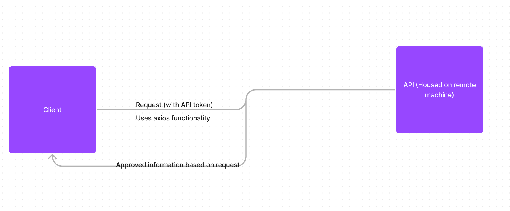
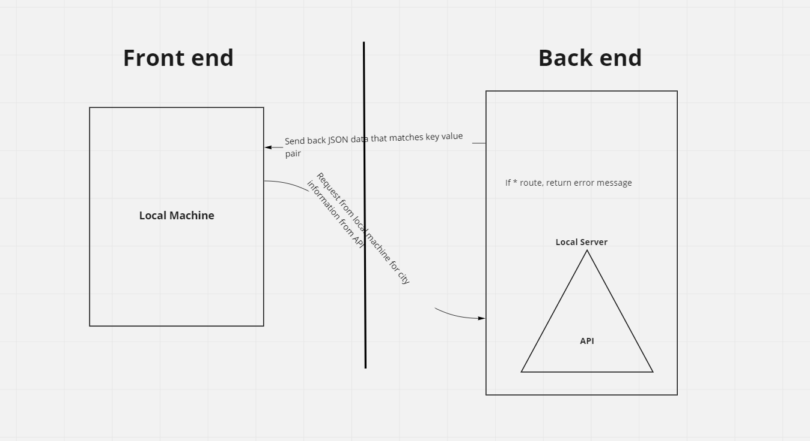
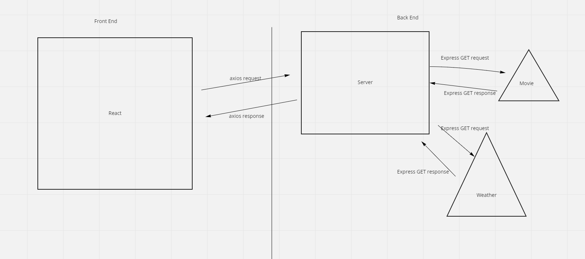

# City Explorer

**Author**: Vinny Shipley

**Version**: 1.0.0

## Overwiew

This app is designed to hlp people find out more information about potential places that they would like to visit, with the hlp of LocationIQ API

## Getting Started

The user needs to have React installed to run this applciation, as well as their own access to a API token

## Architecture

## Change Log

05-16-2022 Created

## Credit and Collaborations

Denis Rendon and Vinny Shipley created the API wireframe shown here: 

Elizabeth Hammes and Vinny Shipley created the API wireframe shown here: 

Yu-Wei Hsieh and Vinny Shipley created teh API wireframe shown here: 

### Lab 06

Name of feature: Setting up API functionality

Estimate of time needed to complete: 3 hours

Start time: 1:45 pm

Finish time: 5:45 pm

Actual time needed to complete: 4 hours
